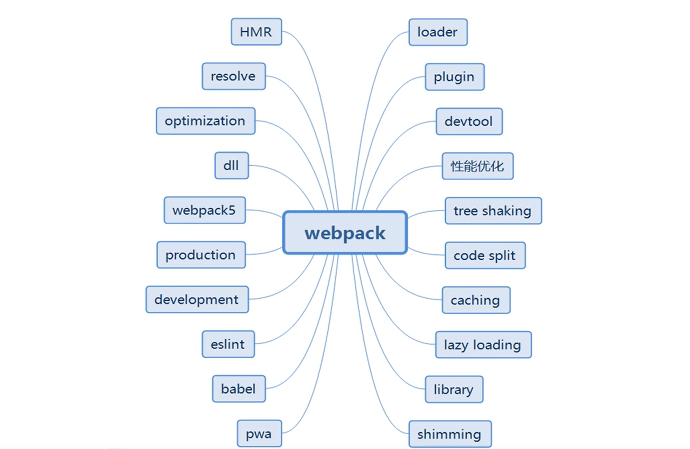

webpack入门到精通

教学视频地址： [尚硅谷2020最新版Webpack5实战教程](https://www.bilibili.com/video/BV1e7411j7T5)

**技能点**



**环境参数**（本机）

Nodejs v13.8.0

webpack 4.43.0

## webpack简介

**weback是什么**

* 前端资源构建工具
* 静态模块打包器（module bundler）

**webpack五个核心概念**

| 名称    | 描述 |
| ------- | ---- |
| Entry   | 入口 |
| Output  | 出口 |
| Loader  | 转换 |
| Plugins | 插件 |
| Mode    | 模式 |

## webpack初体验

**安装**

```shell
npm i webpack webpack-cli -D
```

**使用**

```shell
#开发模式
webpack ./src/index.js -o ./build/built.js --mode=development
#生成模式
webpack ./src/index.js -o ./build/built.js --mode=production
```

> 未配置前，只能处理js/json文件，不能处理css/img等其他资源

**配置模板**

```js
// file:webpack.config.js   webpack的配置文件
const {resolve} = require('path')
module.exports = {
  // 入口起点
  entry: './src/index.js',
  // 出口
  output: {
    filename: 'built.js',
    path: resolve(__dirname, 'build') 
  },
  // loader的配置
  module: {
    rules: [
    // 详细loader配置
    ]
  },
  // plugins的配置
  plugins: [
  ],
  // 模式
  mode: 'development' //开发模式
  // mode: 'production' //生产模式
}
```

## 打包样式资源

安装

```shell
npm i style-loader css-loader -D
npm i less-loader -D
```

配置

```js
// file:webpack.config.js
module: {
  rules: [
  // 详细loader配置
  {
    test: /\.css$/, //匹配css文件
    use: [
      'style-loader', // 将js中的样式资源，添加到head中
      'css-loader' // 将css变成模块加载到js中
    ]
  }
  ]
},
{
  test: /\.less$/, //匹配less文件
  use: [
    'style-loader', // 将js中的样式资源，添加到head中
    'css-loader', // 将css变成模块加载到js中
    'less-loader' // 将less转成css文件
  ]
}    
```

运行

```shell
webpack
```

## 打包html资源

安装

```
npm i html-webpack-plugin -D
```

引入

```js
// file:webpack.config.js
const HtmlWebpackPlugin = require('html-webpack-plugin')
```

使用

```js
// file:webpack.config.js
plugins: [
  new HtmlWebpackPlugin({
    template: './src/index.html'
  })
]
```

## 打包图片资源

安装

```shell
npm i url-loader file-loader html-loader -D
```

配置

```js
// file:webpack.config.js
module: {
    {
      // 处理图片资源
      test: /\.(jpg|png|gif)$/,
      // 只有一个lodaer，可以不用use
      loader: 'url-loader',
      options: {
        // 图片小于8kb,就会被base64处理
        limit: 8 * 1024,
        // 视频说俩种图片处理有冲突报错，不过我这边没冲突
        // esModule: false,
        // 重命名
        name: '[hash:8].[ext]'
      }
    }
  ]
}
// 处理html文件中的图片
{
    test: /\.html$/,
    loader: 'html-loader'
}
```

